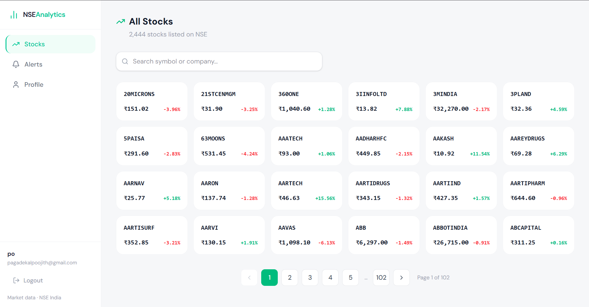
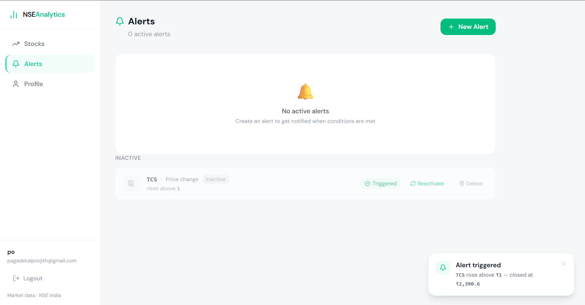

# NSE Analytics

A full-stack platform for tracking NSE-listed stocks, analyzing earnings, and setting price alerts. Backend designed around async job processing, automated data ingestion, and event-driven notifications.


---

## Why I built this

NSE publishes daily market data as public CSV files. I wanted to build something that actually ingests, stores, and reacts to real financial data — not mock APIs. The goal was to practice backend systems design: job queues, scheduled ingestion, event-driven alerts, and near real-time delivery to the frontend.

---

## Screenshots

**Stocks page** — price cards with daily % change



**Alert triggered** — toast notification on the frontend



---

## Features

- **Daily stock data** — automatically ingests NSE Bhavcopy CSV data every weekday at 7pm IST via a scheduled BullMQ job
- **Price charts** — interactive OHLC charts with 1W / 1M / 3M / 1Y range selection
- **Earnings history** — quarterly revenue, net profit, EPS, and YoY growth per stock
- **Price alerts** — set threshold-based alerts that evaluate against daily closing prices and notify in near real-time via WebSocket
- **Auth** — JWT-based authentication with register, login, profile management, and password/email change

---

## Architecture

```
Browser
  └── Nginx :80
        ├── /api/*        → Express backend :3000
        ├── /socket.io/*  → Socket.io (WebSocket)
        └── /*            → React SPA (built files)

Express backend
  ├── REST API (auth, stocks, earnings, alerts, ingest)
  ├── BullMQ worker
  │     ├── Downloads NSE Bhavcopy ZIP from nsearchives.nseindia.com
  │     ├── Parses ~2000 EQ stocks from CSV
  │     ├── Upserts DailyPrice records into PostgreSQL
  │     └── Evaluates active PRICE_CHANGE alerts → emits alert:triggered via Socket.io
  └── node-cron → enqueues Bhavcopy job at 7pm IST Mon–Fri

Data layer
  ├── PostgreSQL (via Prisma ORM) — stocks, prices, earnings, alerts, users
  └── Redis — BullMQ job queue + worker connection
```

---

## Tech Stack

| Layer | Technology |
|---|---|
| Backend | Node.js, Express, TypeScript |
| Frontend | React 19, TypeScript, Vite, Tailwind CSS v4, TanStack Query |
| Real-time (client) | Socket.io client |
| Database | PostgreSQL 16, Prisma ORM |
| Queue | BullMQ, Redis 7 |
| Real-time (server) | Socket.io |
| Auth | JWT, bcrypt |
| Infra | Docker, Docker Compose, Nginx |
| CI | GitHub Actions (TypeScript typecheck) |

---

## Getting Started

### Prerequisites

- [Docker Desktop](https://www.docker.com/products/docker-desktop/)
- Node.js 20+
- npm

### Development setup

**1. Clone the repo**
```bash
git clone https://github.com/poojithpagadekal/nse-analytics.git
cd nse-analytics
```

**2. Set up environment variables**
```bash
# Backend
cp backend/.env.example backend/.env
# Edit backend/.env and fill in your values

# Frontend
cp frontend/.env.example frontend/.env
```

**3. Start PostgreSQL and Redis**
```bash
docker compose -f docker-compose.dev.yml up -d
```

**4. Run database migrations**
```bash
cd backend
npx prisma migrate dev
```

**5. Start the backend**
```bash
cd backend
npm install
npm run dev
```

**6. Start the frontend** (new terminal)
```bash
cd frontend
npm install
npm run dev
```

Frontend runs on `http://localhost:5173`, backend on `http://localhost:3000`.

---

### Production setup (full Docker)

```bash
cp .env.example .env
# Edit .env with production values

docker compose up -d
```

App is available at `http://localhost`.

---

### Seeding data

After setup, the app starts empty. Do these two steps to see real data:

**Step 1 — Ingest stock prices**

Register a user, log in to get a JWT, then trigger a Bhavcopy ingestion for a recent trading day (skip weekends and public holidays):

```bash
curl -X POST http://localhost:3000/ingest/bhavcopy \
  -H "Authorization: Bearer YOUR_JWT" \
  -H "Content-Type: application/json" \
  -d '{"date": "2026-03-20"}'
```

This downloads the NSE Bhavcopy ZIP, parses ~2000 EQ stocks, and upserts closing prices into PostgreSQL. Run it for multiple dates to populate the price charts.

**Step 2 — Add earnings data**

Bhavcopy does not include earnings. Use the seed commands in [`backend/seed-earnings.sh`](./backend/seed-earnings.sh) to populate quarterly results for five major NSE stocks — see [Manual Earnings Ingestion](#manual-earnings-ingestion) below.

---

## Database Schema

```
User          — id, email, password (hashed), name
Stock         — id, symbol (unique), name, sector, industry
DailyPrice    — stockId, date, open, high, low, close, volume  [unique: stockId+date]
EarningResult — stockId, quarter, revenue, netProfit, eps, yoyGrowth, announcedAt  [unique: stockId+quarter]
Alert         — userId, stockId, type, condition, threshold, isActive, triggeredAt
```

---

## API Reference

### Auth

| Method | Endpoint | Auth | Description |
|---|---|---|---|
| POST | `/auth/register` | — | Create account |
| POST | `/auth/login` | — | Login, returns JWT |
| GET | `/auth/me` | ✓ | Get current user |
| PATCH | `/auth/profile` | ✓ | Update display name |
| PATCH | `/auth/password` | ✓ | Change password |
| PATCH | `/auth/email` | ✓ | Change email |

### Stocks

| Method | Endpoint | Auth | Description |
|---|---|---|---|
| GET | `/stocks` | — | All stocks with latest price |
| GET | `/stocks/:symbol` | — | Single stock |
| GET | `/stocks/:symbol/prices` | — | Daily prices (`?from=YYYY-MM-DD&to=YYYY-MM-DD`) |

### Earnings

| Method | Endpoint | Auth | Description |
|---|---|---|---|
| GET | `/earnings/:symbol` | — | Earnings history (`?quarter=Q1FY25`) |
| POST | `/earnings` | ✓ | Add an earnings result manually |

### Alerts

| Method | Endpoint | Auth | Description |
|---|---|---|---|
| GET | `/alerts` | ✓ | User's alerts (`?symbol=TCS&isActive=true`) |
| POST | `/alerts` | ✓ | Create alert |
| PATCH | `/alerts/:id/deactivate` | ✓ | Deactivate alert |
| PATCH | `/alerts/:id/reactivate` | ✓ | Reactivate alert |
| DELETE | `/alerts/:id` | ✓ | Delete alert |

### Ingest

| Method | Endpoint | Auth | Description |
|---|---|---|---|
| POST | `/ingest/bhavcopy` | ✓ | Manually trigger Bhavcopy ingestion for a date |

---

## How Alerts Work

1. User creates a `PRICE_CHANGE` alert — e.g. TCS rises above ₹4000
2. Every weekday at 7pm IST, the Bhavcopy worker ingests closing prices
3. After ingestion, the alert evaluator queries all active alerts and compares conditions against the new closing prices
4. Triggered alerts are marked `isActive: false` with a `triggeredAt` timestamp
5. An `alert:triggered` Socket.io event is emitted to the user's personal room
6. The frontend shows a toast notification and refreshes the alerts list

---

## Manual Earnings Ingestion

Bhavcopy CSVs contain only price data. Earnings results must be added via `POST /earnings`. Below are real quarterly figures for five major NSE-listed companies, sourced from NSE's quarterly results filings.

Replace `YOUR_JWT` with the token from `/auth/login`. All revenue and net profit figures are in **₹ crore**.

The full set of curl commands is also available as a shell script at [`backend/seed-earnings.sh`](./backend/seed-earnings.sh) — set your `JWT` variable and run it in one go.

### TCS

```bash
curl -X POST http://localhost:3000/earnings \
  -H "Authorization: Bearer YOUR_JWT" \
  -H "Content-Type: application/json" \
  -d '{"symbol":"TCS","quarter":"Q3FY26","revenue":63973,"netProfit":12380,"eps":33.76,"yoyGrowth":5.6,"announcedAt":"2026-01-09"}'

curl -X POST http://localhost:3000/earnings \
  -H "Authorization: Bearer YOUR_JWT" \
  -H "Content-Type: application/json" \
  -d '{"symbol":"TCS","quarter":"Q2FY26","revenue":62322,"netProfit":11909,"eps":32.48,"yoyGrowth":4.5,"announcedAt":"2025-10-10"}'

curl -X POST http://localhost:3000/earnings \
  -H "Authorization: Bearer YOUR_JWT" \
  -H "Content-Type: application/json" \
  -d '{"symbol":"TCS","quarter":"Q1FY26","revenue":63437,"netProfit":12760,"eps":34.79,"yoyGrowth":5.4,"announcedAt":"2025-07-10"}'

curl -X POST http://localhost:3000/earnings \
  -H "Authorization: Bearer YOUR_JWT" \
  -H "Content-Type: application/json" \
  -d '{"symbol":"TCS","quarter":"Q4FY25","revenue":63437,"netProfit":12224,"eps":33.33,"yoyGrowth":4.5,"announcedAt":"2025-04-10"}'
```

### Infosys

```bash
curl -X POST http://localhost:3000/earnings \
  -H "Authorization: Bearer YOUR_JWT" \
  -H "Content-Type: application/json" \
  -d '{"symbol":"INFY","quarter":"Q3FY26","revenue":41764,"netProfit":6806,"eps":16.45,"yoyGrowth":7.4,"announcedAt":"2026-01-16"}'

curl -X POST http://localhost:3000/earnings \
  -H "Authorization: Bearer YOUR_JWT" \
  -H "Content-Type: application/json" \
  -d '{"symbol":"INFY","quarter":"Q2FY26","revenue":40986,"netProfit":6506,"eps":15.72,"yoyGrowth":4.7,"announcedAt":"2025-10-17"}'

curl -X POST http://localhost:3000/earnings \
  -H "Authorization: Bearer YOUR_JWT" \
  -H "Content-Type: application/json" \
  -d '{"symbol":"INFY","quarter":"Q1FY26","revenue":39390,"netProfit":6368,"eps":15.38,"yoyGrowth":6.1,"announcedAt":"2025-07-17"}'

curl -X POST http://localhost:3000/earnings \
  -H "Authorization: Bearer YOUR_JWT" \
  -H "Content-Type: application/json" \
  -d '{"symbol":"INFY","quarter":"Q4FY25","revenue":37923,"netProfit":7033,"eps":16.99,"yoyGrowth":11.8,"announcedAt":"2025-04-17"}'
```

### Reliance Industries

```bash
curl -X POST http://localhost:3000/earnings \
  -H "Authorization: Bearer YOUR_JWT" \
  -H "Content-Type: application/json" \
  -d '{"symbol":"RELIANCE","quarter":"Q3FY26","revenue":243422,"netProfit":18540,"eps":27.48,"yoyGrowth":7.4,"announcedAt":"2026-01-16"}'

curl -X POST http://localhost:3000/earnings \
  -H "Authorization: Bearer YOUR_JWT" \
  -H "Content-Type: application/json" \
  -d '{"symbol":"RELIANCE","quarter":"Q2FY26","revenue":235481,"netProfit":16563,"eps":24.54,"yoyGrowth":2.8,"announcedAt":"2025-10-14"}'

curl -X POST http://localhost:3000/earnings \
  -H "Authorization: Bearer YOUR_JWT" \
  -H "Content-Type: application/json" \
  -d '{"symbol":"RELIANCE","quarter":"Q1FY26","revenue":236047,"netProfit":17448,"eps":25.86,"yoyGrowth":12.1,"announcedAt":"2025-07-18"}'

curl -X POST http://localhost:3000/earnings \
  -H "Authorization: Bearer YOUR_JWT" \
  -H "Content-Type: application/json" \
  -d '{"symbol":"RELIANCE","quarter":"Q4FY25","revenue":264762,"netProfit":19407,"eps":28.79,"yoyGrowth":6.7,"announcedAt":"2025-04-25"}'
```

### HDFC Bank

```bash
curl -X POST http://localhost:3000/earnings \
  -H "Authorization: Bearer YOUR_JWT" \
  -H "Content-Type: application/json" \
  -d '{"symbol":"HDFCBANK","quarter":"Q3FY26","revenue":78006,"netProfit":16736,"eps":22.02,"yoyGrowth":2.2,"announcedAt":"2026-01-22"}'

curl -X POST http://localhost:3000/earnings \
  -H "Authorization: Bearer YOUR_JWT" \
  -H "Content-Type: application/json" \
  -d '{"symbol":"HDFCBANK","quarter":"Q2FY26","revenue":76970,"netProfit":16821,"eps":22.13,"yoyGrowth":5.3,"announcedAt":"2025-10-18"}'

curl -X POST http://localhost:3000/earnings \
  -H "Authorization: Bearer YOUR_JWT" \
  -H "Content-Type: application/json" \
  -d '{"symbol":"HDFCBANK","quarter":"Q1FY26","revenue":74015,"netProfit":16175,"eps":21.28,"yoyGrowth":0.2,"announcedAt":"2025-07-19"}'

curl -X POST http://localhost:3000/earnings \
  -H "Authorization: Bearer YOUR_JWT" \
  -H "Content-Type: application/json" \
  -d '{"symbol":"HDFCBANK","quarter":"Q4FY25","revenue":74016,"netProfit":17616,"eps":23.17,"yoyGrowth":6.7,"announcedAt":"2025-04-19"}'
```

### Wipro

```bash
curl -X POST http://localhost:3000/earnings \
  -H "Authorization: Bearer YOUR_JWT" \
  -H "Content-Type: application/json" \
  -d '{"symbol":"WIPRO","quarter":"Q3FY26","revenue":22319,"netProfit":3354,"eps":3.23,"yoyGrowth":4.5,"announcedAt":"2026-01-15"}'

curl -X POST http://localhost:3000/earnings \
  -H "Authorization: Bearer YOUR_JWT" \
  -H "Content-Type: application/json" \
  -d '{"symbol":"WIPRO","quarter":"Q2FY26","revenue":22302,"netProfit":3209,"eps":3.09,"yoyGrowth":5.4,"announcedAt":"2025-10-16"}'

curl -X POST http://localhost:3000/earnings \
  -H "Authorization: Bearer YOUR_JWT" \
  -H "Content-Type: application/json" \
  -d '{"symbol":"WIPRO","quarter":"Q1FY26","revenue":22370,"netProfit":3330,"eps":3.21,"yoyGrowth":4.6,"announcedAt":"2025-07-16"}'

curl -X POST http://localhost:3000/earnings \
  -H "Authorization: Bearer YOUR_JWT" \
  -H "Content-Type: application/json" \
  -d '{"symbol":"WIPRO","quarter":"Q4FY25","revenue":22437,"netProfit":3569,"eps":3.44,"yoyGrowth":25.9,"announcedAt":"2025-04-16"}'
```

> **Note:** Figures are sourced from NSE quarterly filings and are approximate. Verify against the official [NSE results page](https://www.nseindia.com/companies-listing/corporate-filings-financial-results) before using in any production context.

---

## Known Limitations

- **Company names** — Bhavcopy CSV does not include company names. Stocks ingested via Bhavcopy show the ticker symbol as the name until a separate company master data source is integrated.
- **Sector data** — not available in Bhavcopy. Sector badges only appear for stocks manually created via `POST /stocks`.
- **Alert types** — only `PRICE_CHANGE` alerts are evaluated. `EPS_GROWTH` and `REVENUE_GROWTH` are defined in the schema but reserved for future implementation.
- **NSE data availability** — Bhavcopy files are only published on market trading days. Weekend and holiday ingestion requests will fail with a download error.
- **Earnings data** — not sourced automatically. Earnings must be added manually via `POST /earnings`. See [Manual Earnings Ingestion](#manual-earnings-ingestion) above for seed data. A future improvement would be ingesting from NSE's quarterly results calendar.

---

## Project Structure

```
nse-analytics/
├── backend/
│   ├── prisma/
│   │   └── schema.prisma
│   ├── seed-earnings.sh         # curl commands to seed earnings for 5 major stocks
│   └── src/
│       ├── config/              # env, prisma, redis, socket singletons
│       ├── lib/                 # errorHandler, errors, health, ingest router
│       ├── middlewares/         # authenticate (JWT)
│       ├── modules/
│       │   ├── auth/            # register, login, profile management
│       │   ├── stocks/          # stock + daily price endpoints
│       │   ├── earnings/        # earnings history endpoints
│       │   └── alerts/          # alert CRUD
│       └── workers/
│           ├── queues/          # BullMQ queue definitions
│           └── processors/      # bhavcopy.processor, alert-evaluator.processor
├── frontend/
│   └── src/
│       ├── api/                 # axios client + endpoint functions
│       ├── components/          # reusable UI components
│       ├── hooks/               # TanStack Query hooks + useSocket
│       ├── pages/               # one file per route
│       └── types/               # shared TypeScript interfaces
├── nginx/
│   └── nginx.conf
├── docker-compose.yml           # production — all services
├── docker-compose.dev.yml       # development — postgres + redis only
└── .github/workflows/ci.yml
```